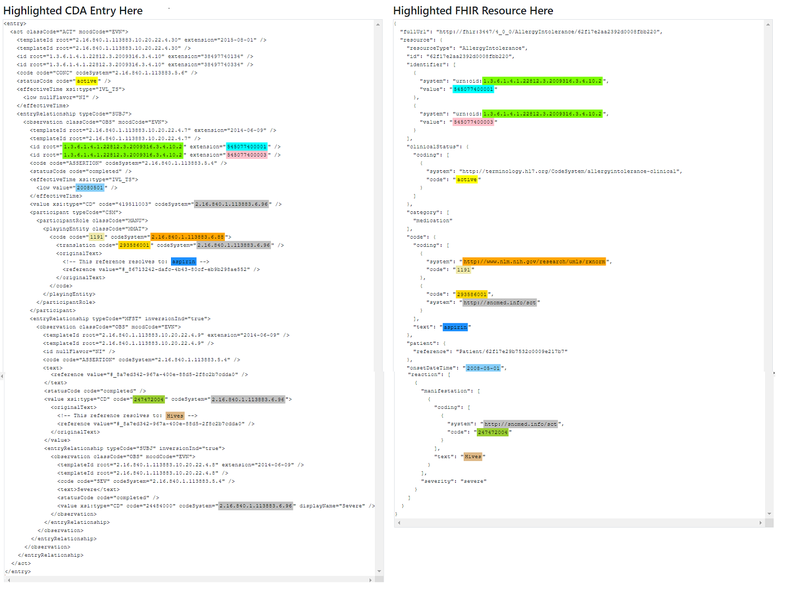

XPath abbrievated in table as follows: CDA &lt;base&gt; = ClinicalDocument/structuredBody/component/structuredBody/component/section[(@code="48765-2")]/entry/act/entryRelationship/observation

**Case:** Only perform the action under this constraint  
**Guidance:** Generalized narrative guidance on transform between CDA and FHIR elements  
**ConceptMap:** Link to computable map between CDA and FHIR vocabularies  
**Note:** Note specific to this mapping  

### C-CDA to FHIR

| C-CDA  ([observation](http://hl7.org/cda/stds/core/draft1/StructureDefinition-Observation.html)) | FHIR  ([AllergyIntolerance](https://build.fhir.org/ig/HL7/US-Core/StructureDefinition-us-core-allergyintolerance.html))| Transform Steps & Notes|
|:-------|:------|:---------|
|[&lt;base&gt;/id](https://build.fhir.org/ig/HL7/CDA-ccda-2.1-sd/StructureDefinition-2.16.840.1.113883.10.20.22.4.7-definitions.html#diff_Observation.id)|[.identifier](https://build.fhir.org/ig/HL7/US-Core/StructureDefinition-us-core-allergyintolerance-definitions.html#AllergyIntolerance.id)|**Guidance:** [CDA id <> FHIR identifier]()|
|[&lt;base&gt;/effectiveTime/low]()|[.onsetDateTime]()|**Guidance**: [CDA <> FHIR Time/Dates]() **Note:** EffectiveTime/high should not be mapped within onset (DateTime or Period)|
|[&lt;base&gt;/value]()|[.type]() &  [.category]()|**Guidance:** [CDA CD <> FHIR CodeableConcept]() **ConceptMap:** [Allergy value <> category ConceptMap]() **ConceptMap:** [Allergy value <> type ConceptMap]()|
|[&lt;base&gt;/author]()|[.recorder]() & [Provenance]()|**Case:** Only map single CDA author to FHIR recorder **Guidance:** [Generalized guidance on CDA and FHIR provenance]()|
|[&lt;base&gt;/author/time]()|[.recorded]()|**Case:** Only map earliest author/time  **Guidance:** [CDA <> FHIR Time/Dates]()|
|[&lt;base&gt;/participant/participantRole /playingEntity/code]()|[.code]()|**Case**: Only when CDA negation not present **Guidance**: [CDA CD <> FHIR CodeableConcept]()|
|**Status** (observation/code@code="33999-4") [&lt;base&gt;/entryRelationship/observation/value]()|[.clinicalStatus]()|**Guidance:** [CDA CD <> FHIR CodeableConcept]()
|**Reaction** [&lt;base&gt;/entryRelationship/observation/id]()|[.reaction[x].id]() 
|[&lt;base&gt;/entryRelationship/observation /effectiveTime/low]()|[.reaction[x].onset]()|**Guidance:** [CDA <> FHIR Time/Dates]() **Note:** effectiveTime/high should not be mapped within onset
|[&lt;base&gt;/entryRelationship/observation/value]()|[.reaction[x].manifestation]()|**Guidance:** [CDA CD <> FHIR CodeableConcept]() **Note:** Both  use SNOMED clinical findings with minor valueSet definition differences
|**Criticality** (observation/code@code="82606-5") [&lt;base&gt;/entryRelationship/observation/value]()|[.criticality]()|**Guidance:** [CDA CD <> FHIR CodeableConcept]() **ConceptMap:** [Allergy Criticality value <> criticality]()

### FHIR to C-CDA

| FHIR  ([AllergyIntolerance](https://build.fhir.org/ig/HL7/US-Core/StructureDefinition-us-core-allergyintolerance.html))| C-CDA  ([observation](http://hl7.org/cda/stds/core/draft1/StructureDefinition-Observation.html))| Transform Steps & Notes|
|:-------|:------|:---------|
|[.identifier](https://build.fhir.org/ig/HL7/US-Core/StructureDefinition-us-core-allergyintolerance-definitions.html#AllergyIntolerance.id)|[&lt;base&gt;/id](https://build.fhir.org/ig/HL7/CDA-ccda-2.1-sd/StructureDefinition-2.16.840.1.113883.10.20.22.4.7-definitions.html#diff_Observation.id)|**Guidance:** [CDA id <> FHIR identifier]()|
|[.onsetDateTime]()|[&lt;base&gt;/effectiveTime/low]()|**Guidance**: [CDA <> FHIR Time/Dates]()
|[.type]() &  [.category]()|[&lt;base&gt;/value]()|**Guidance:** [CDA CD <> FHIR CodeableConcept]() **ConceptMap:** [Allergy value <> category ConceptMap]() **ConceptMap:** [Allergy value <> type ConceptMap]()|
|[.recorder]() & [Provenance]()|[&lt;base&gt;/author]()|**Guidance:** [Generalized guidance on CDA and FHIR provenance]()|
|[.recorded]()|[&lt;base&gt;/author/time]()|**Guidance:** [CDA <> FHIR Time/Dates]()|
|[&lt;base&gt;/participant/participantRole /playingEntity/code]()|[.code]()|**Guidance**: [CDA CD <> FHIR CodeableConcept]()|
|[.clinicalStatus]()|**Status** (observation/code@code="33999-4") [&lt;base&gt;/entryRelationship/observation/value]()|**Guidance:** [CDA CD <> FHIR CodeableConcept]()
|[.reaction[x].id]()|**Reaction** [&lt;base&gt;/entryRelationship/observation/id]()
|[.reaction[x].onset]()|[&lt;base&gt;/entryRelationship/observation /effectiveTime/low]()|**Guidance:** [CDA <> FHIR Time/Dates]() **Note:** effectiveTime/high should not be mapped within onset
|[.reaction[x].manifestation]()|[&lt;base&gt;/entryRelationship/observation/value]()|**Guidance:** [CDA CD <> FHIR CodeableConcept]() **Note:** Both  use SNOMED clinical findings with minor valueSet definition differences
|[.criticality]()|**Criticality** (observation/code@code="82606-5") [&lt;base&gt;/entryRelationship/observation/value]()|**Guidance:** [CDA CD <> FHIR CodeableConcept]() **ConceptMap:** [Allergy Criticality value <> criticality]()

### Illustrative example

An illustrative example with higlighting is shown below based on the consensus of mapping and guidance above. Not all possible elements in CDA or FHIR may be represented 

Source data for the above example is available: 
* [LEFT: Allergy CDA example]()
* [RIGHT: Allergy FHIR example](./AllergyIntolerance-allergy-intolerance-mapped-to-FHIR.html)